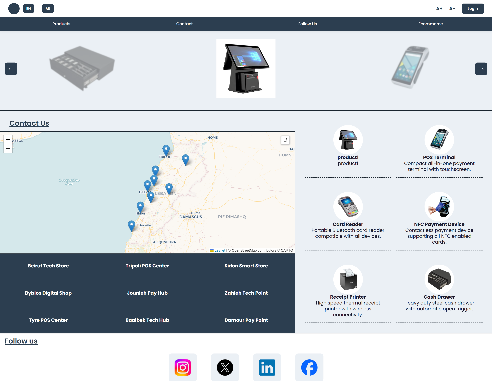
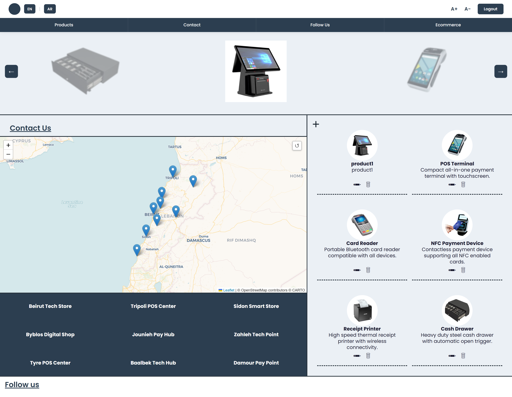
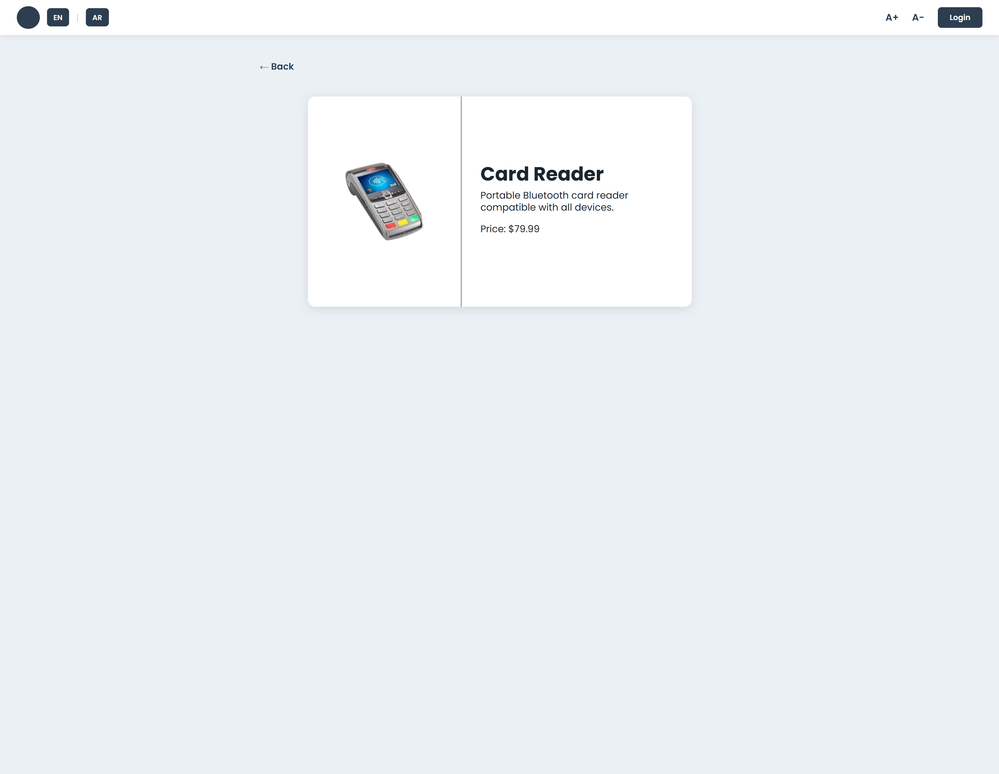
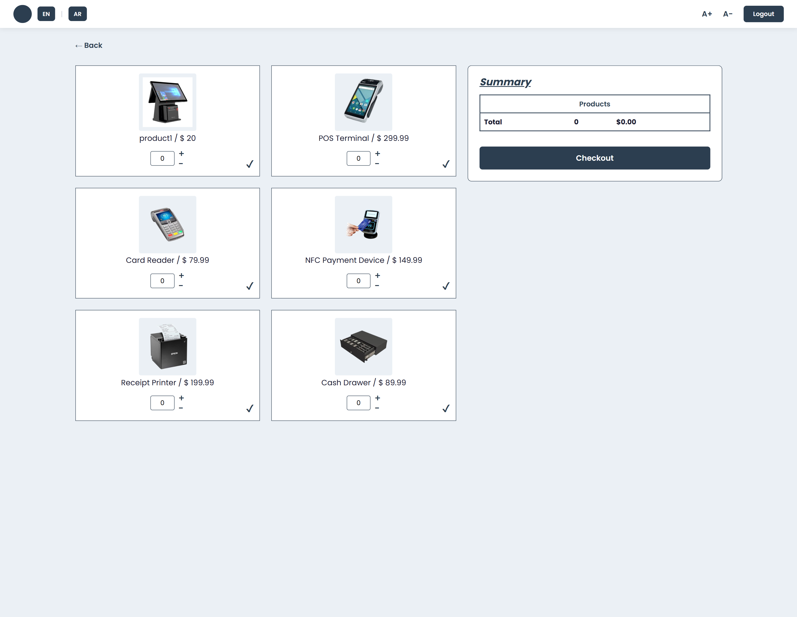
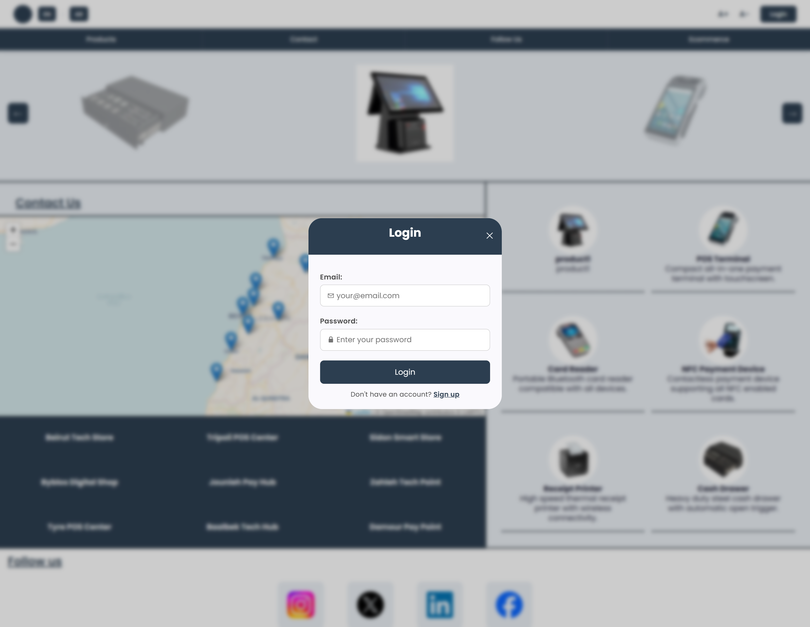
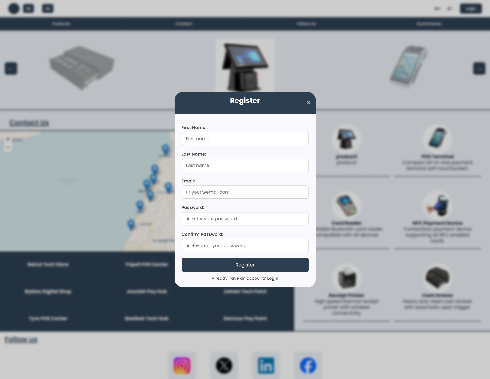
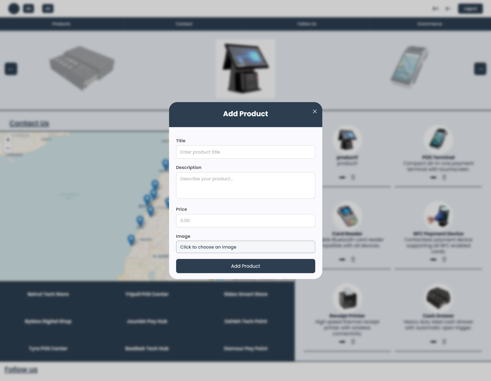
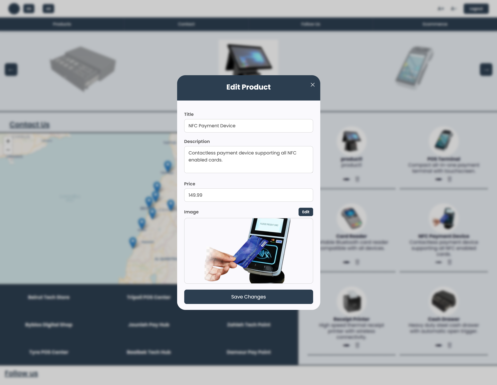
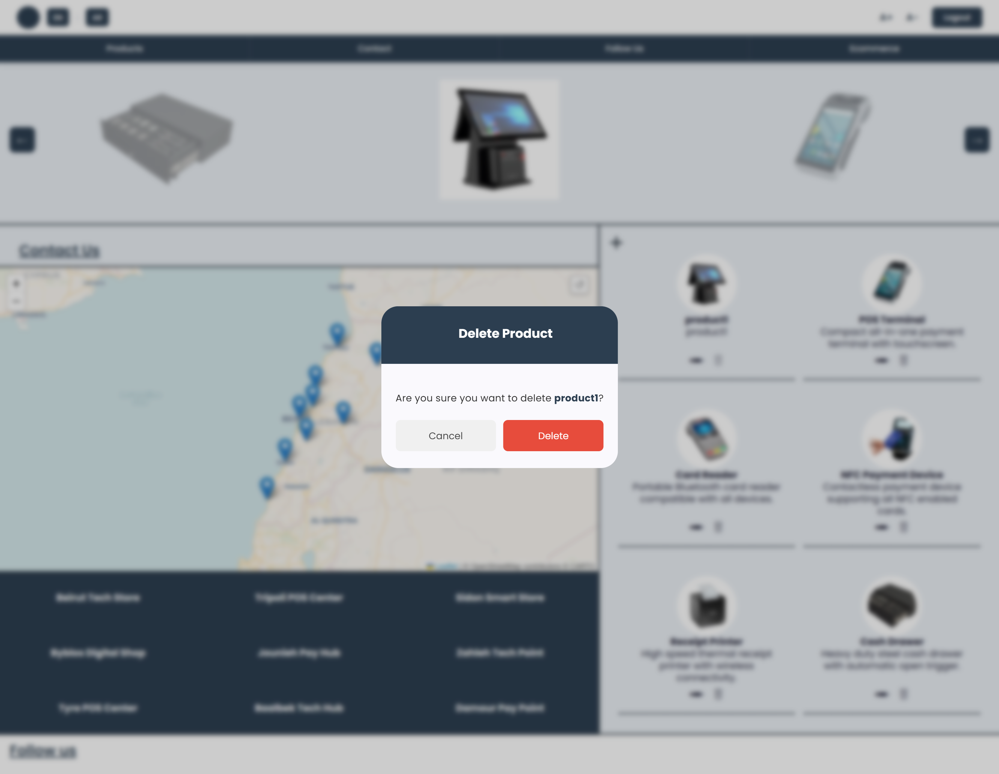
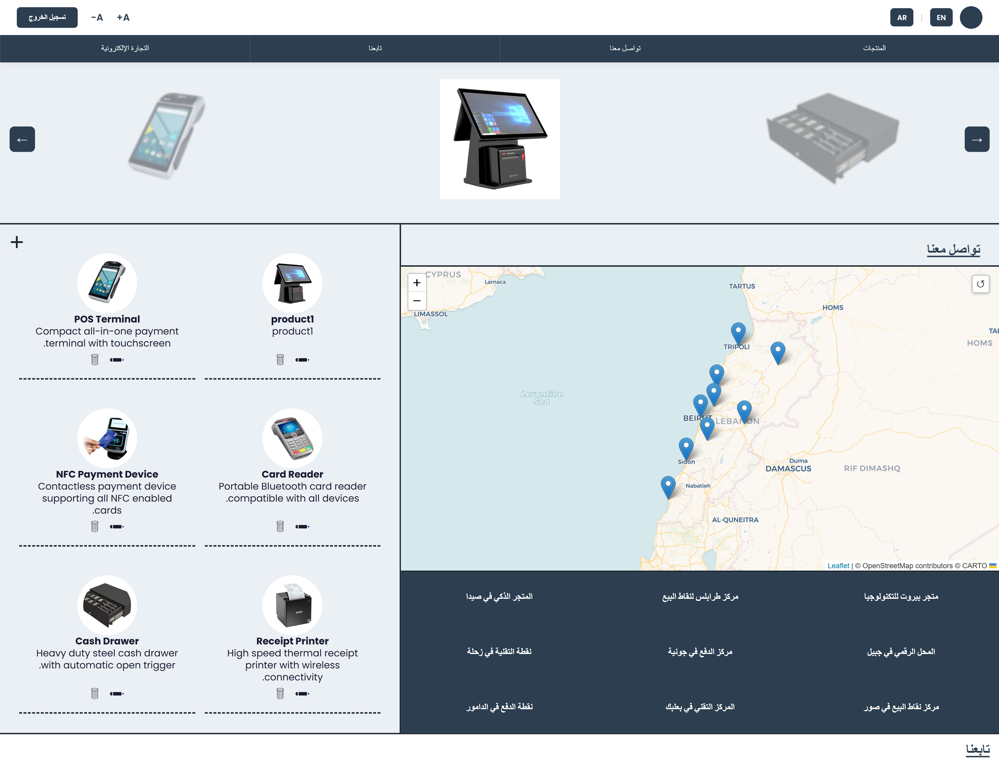

# ShopsApp v2

**Version 2** of ShopsApp, a full rebuild of the original PHP/jQuery e-commerce demo. The old procedural PHP + jQuery + MySQL app has been replaced with a proper **Angular** frontend talking to a **Laravel** REST API backend, secured with token-based authentication (Laravel Sanctum) and role-based access control.

## Tech Stack

- **Angular** (standalone components, signals) — frontend framework
- **Laravel** — backend REST API
- **SQLite** — data storage, accessed via Eloquent ORM (file-based, no separate database server required)

**Key libraries & packages:**
- **Laravel Sanctum** — token-based API authentication
- **ngx-translate** — internationalization (English/Arabic with full RTL support)
- **Angular Material** — UI components (modals/dialogs)
- **Leaflet.js** — interactive store-locator map on the home page

On the backend, `User`, `Role`, and `Product` are related through Eloquent (`User belongsTo Role`, `Role hasMany User`), and authorization is enforced through a `ProductPolicy` that restricts creating, updating, and deleting products to users whose role is `admin`. On login or registration, `AuthController` issues a Sanctum personal access token, which the Angular frontend stores and attaches as a `Bearer` token on every subsequent API request via an HTTP interceptor.

## What's New in Version 2

Version 1 was a plain PHP/jQuery/MySQL app with session-based auth, no roles, no translations (placeholder buttons), image URLs entered as text, and no user registration (login only). Version 2 is a ground-up rebuild:

- **Full architectural rebuild** — from procedural PHP to a decoupled Angular (SPA) frontend + Laravel REST API backend
- **Token-based authentication** via Laravel Sanctum, replacing PHP sessions
- **User registration** — new self-service sign-up flow (Version 1 only supported logging in with pre-existing accounts)
- **Role-based access control (RBAC)** — `admin` and `user` roles; only admins can create, edit, or delete products, enforced by a Laravel policy and reflected in the Angular UI
- **Modal-based UI** — login, register, logout, and add/edit/delete product flows all use Angular Material dialogs instead of full page reloads
- **Real image uploads** — products are created with actual file uploads (`multipart/form-data`, validated and stored server-side), replacing Version 1's plain image-URL text field
- **Full internationalization** — English and Arabic via ngx-translate, including complete right-to-left (RTL) layout switching
- **Inline async feedback** — forms show disabled/"submitting" states and inline error messages while requests are in flight

Angular route guards aren't used here — access control in the frontend is done via a reactive `isAdmin` signal that conditionally shows/hides admin-only UI (add/edit/delete buttons). This is a **UX convenience only**. The actual security boundary is enforced server-side by Laravel's `auth:sanctum` middleware (which routes require a valid token) and the `ProductPolicy` (which checks the user's role before allowing any write operation on products) — a non-admin can't perform admin actions no matter what the Angular client sends.

## Setup / Installation

Both the backend and frontend need to run **at the same time** for the app to work: Laravel on `http://127.0.0.1:8000` and Angular on `http://localhost:4200`.

### Backend (Laravel)

```bash
cd backend
composer install
cp .env.example .env
php artisan key:generate
```

By default the app is configured for SQLite (no extra setup needed — just make sure `database/database.sqlite` exists). 

Then run migrations and seed the database (seeders create the `admin`/`user` roles, a default admin account, a couple of demo users, and sample products):

```bash
php artisan migrate --seed
php artisan storage:link
php artisan serve
```

The API will be available at `http://127.0.0.1:8000/api`.

Seeded accounts:

| Role  | Email               | Password |
|-------|----------------------|----------|
| admin | admin@shopsapp.com   | admin123 |
| user  | sarah@example.com    | sarah123 |
| user  | john@example.com     | john123  |

### Frontend (Angular)

```bash
cd frontend
npm install
```

The API URL is already set to `http://127.0.0.1:8000/api` in `src/environments/environment.ts` — update it there if your backend runs elsewhere. Then:

```bash
ng serve
```

The app will be available at `http://localhost:4200`.

## Usage

- **Register** a new account via the sign-up modal, or **log in** with one of the seeded accounts above.
- **Browse products** on the home page and view individual product details.
- Logged-in users can go to the **ecommerce** page to select quantities and build an order from the product catalog.
- **Admins only** (role `admin`) see extra controls on the home product grid to **add, edit, or delete products**, including uploading a product image. Regular users (role `user`) don't see these controls, and attempting the underlying API calls directly is rejected server-side by the `ProductPolicy`.
- Use the nav bar to **switch language** (English/Arabic, with automatic RTL layout) and adjust font size.

## Notes

This is **Version 2** of ShopsApp, part of a multi-version project. **Version 1** — a plain PHP/jQuery/MySQL app with session-based auth and no roles or translations — exists as an earlier, simpler iteration of the same idea. Possible directions for a future version include PWA support (offline access, installability), though this is not yet in progress in this codebase.

## Screenshots

### Home Page

Guest view (products grid, store locator map, contact/follow-us sections):



Admin view — note the add/edit/delete controls on each product card:



### Product Detail



### Ecommerce / Order Page



### Login / Register Modals





### Admin — Add / Edit / Delete Product







### Arabic (RTL) Layout


